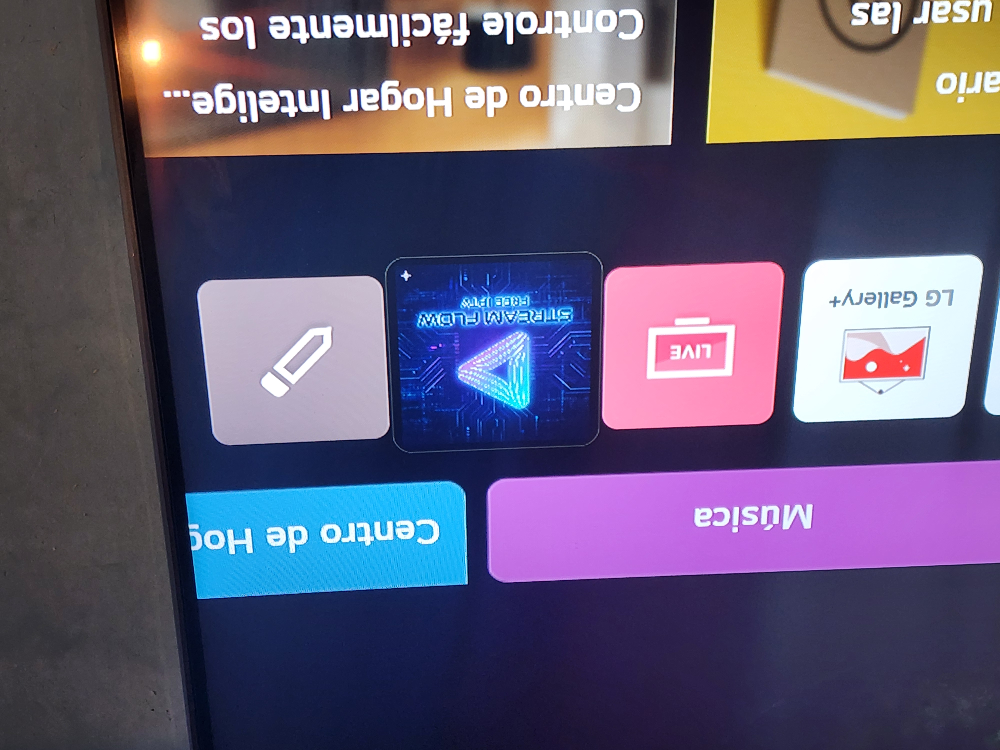
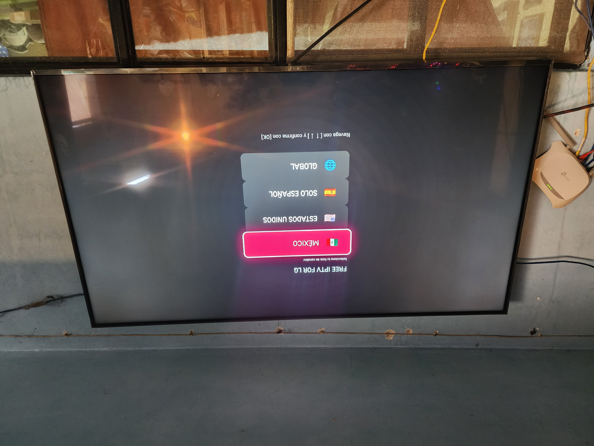
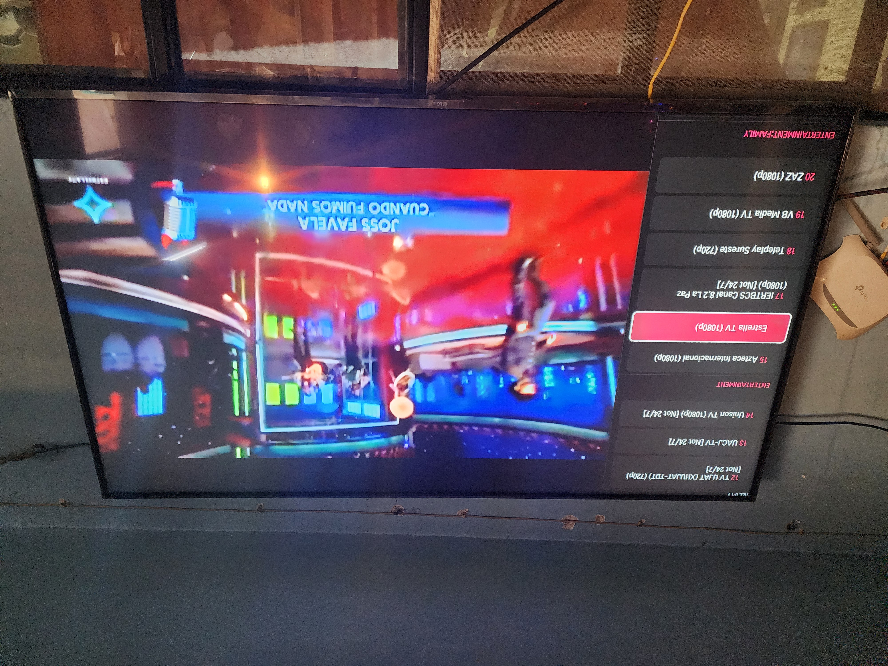
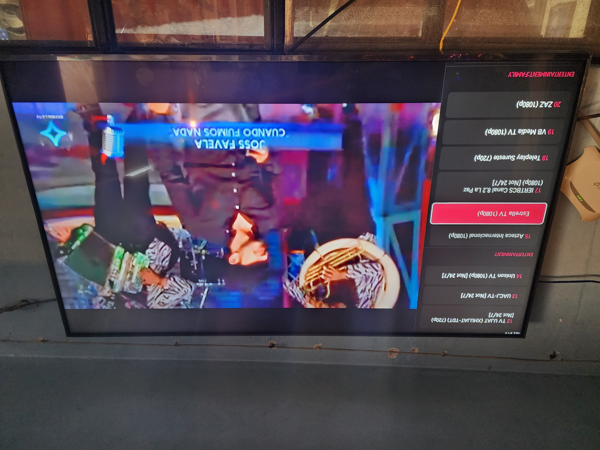
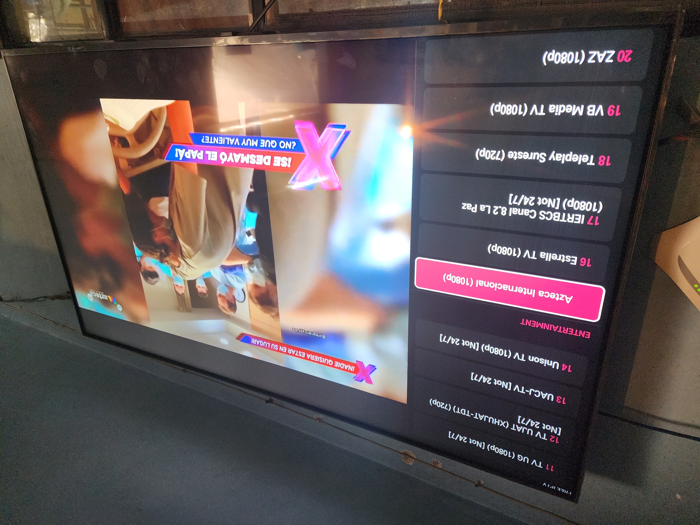

# 📺 Free IPTV For LG

**Free IPTV For LG** is an open-source application designed for LG Smart TVs running **webOS**. It provides a cinematic interface to play M3U playlists, fully optimized for the LG Magic Remote experience.

---

## 📖 My Story
A few years ago, I bought an LG TV, but I quickly grew tired of paying for expensive IPTV subscription services found in the official store. After discovering the potential of the **iptv-org** repository and the **webOS Dev Manager** tool, I decided to put my skills as a Computer Systems Engineer to work and create my own solution.

My goal was to build a platform where anyone could enjoy active channels from the comfort of their TV—**fast, ad-free, and free to use**. My commitment is that this app will always remain free and will never require a paid license.

---

## ⚠️ Legal Disclaimer & Credits
This project is strictly a **content player** and does not provide or host any TV signals or streams.

* **Content Source:** All channel lists and streaming resources are owned and maintained by the public repository **[iptv-org](https://github.com/iptv-org/iptv)**.
* **Resources:** According to the [iptv-org resources documentation](https://github.com/iptv-org/iptv#resources), this project utilizes their public links for informational and functional purposes.
* **Responsibility:** The developer is not responsible for the stability of the signals or the final use of the application.

---

## 🚀 Installation Guide (Step-by-Step)

To install the **.ipk** file for this application, you must set up your television as a development environment.

### 1. Create an LG Developer Account
You must register for a free account at the official portal: **[LG Developer](https://developer.lge.com/)**. Without this account, you cannot obtain the access codes for your TV.

### 2. Prepare the Television
* Install the **Developer Mode** app from the LG Content Store on your TV.
* Log in using the developer account you just created.
* Turn on the **Dev Mode Status** switch (the TV will reboot).
* Turn on the **Key Server** switch.
* **IMPORTANT:** The screen will display your connection data: **IP Address**, **Passphrase**, and port.

### 3. Install via webOS Dev Manager
* Download and install **webOS Dev Manager** on your PC/Mac: [webosbrew/dev-manager-desktop](https://github.com/webosbrew/dev-manager-desktop).
* Add your TV using the **IP** and **Passphrase** obtained in the previous step.
* Once connected, simply drag and drop the provided **`.ipk`** file into the application window to complete the installation.

---

## ✨ Technical Features
* 📁 **Native Integration:** Configured via `appinfo.json` for seamless webOS integration.
* 🌐 **Region Selector:** Initial setup to load channels from Mexico, USA, Spain, or a Global list.
* 📂 **Smart Sorting:** Automatic classification by categories (Sports, Cinema, News, etc.).
* 🔢 **Quick Navigation:** Direct channel numbering support and full Magic Remote compatibility.
* ⏯️ **Signal Validation:** "⚠️ SEARCHING FOR SIGNAL" alert system for broken or offline links.

---

## 🎮 Magic Remote Controls
| Button | Action |
| :--- | :--- |
| **Up / Down** | Navigate through the channel list. |
| **OK (Wheel)** | Play the selected channel. |
| **Left** | Show the side channel menu. |
| **Right** | Hide menu and switch video to Full Screen. |
| **Keypad (0-9)** | Enter channel number for direct access. |
| **Back** | Exit application / Close modals. |

---

## ❤️ Support the Project
If this application has been useful to you and you wish to support me in improving its features, you can make a voluntary donation via **Mercado Pago**:

👉 **[Support ALCA](https://link.mercadopago.com.mx/alcaoficial)**

*Support is entirely optional; the application will remain free and open for everyone.*

---
## IMAGES
## 1

## 2

## 3

## 4

## 5

---

## 👨‍💻 Developer
Project created by **Alca**, Computer Systems Engineer Mexican.
